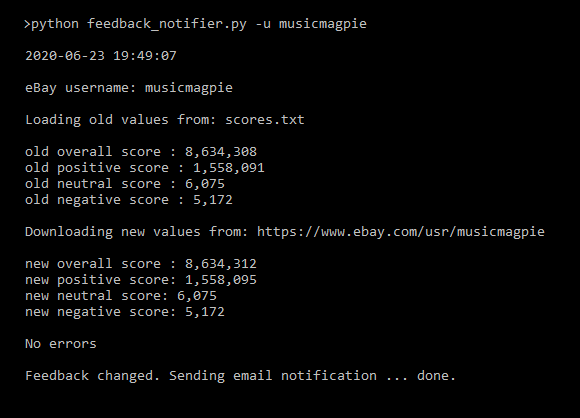
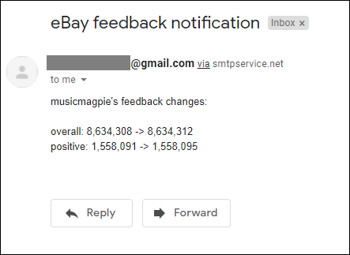

# ebay-feedback-notifier

## Introduction

This Python script sends a notification email if an eBay user's feedback rating changes.
<br><br>

## Requirements
  - Create a free SMTP2GO account at [smtp2go.com](http://smtp2go.com). This allows you to send mail through their SMTP server.
  - Modify the values in the `REQUIRED CUSTOMIZATIONS` section of the Python script.
  ```
# -----------------------------------------------------------------------------
# REQUIRED CUSTOMIZATIONS
# -----------------------------------------------------------------------------

EMAIL_RECIPIENT = 'recipient@email.com'
EMAIL_SENDER    = 'sender@email.com'

SMTP2GO_USERNAME = 'user@email.com'
SMTP2GO_PASSWORD = 'password'
```
<br>
  
## Procedure
  - Run the script using Python version 3.0 or higher.
```
Usage: feedback_notifier.py [-h] -u USERNAME [-f FILENAME]
```
<br><br>

## Example Execution

<p align="center">

</p>
<br><br>

## Example Notification Email

<p align="center">

</p>
<br><br>

## Automation

The script can be run using Unix/Linux cron or Windows Task Scheduler.
```
### Run every hour using cron
0 * * * * cd /home/user/scripts && /usr/bin/python3 /home/user/scripts/feedback_notifier.py -u musicmagpie > /home/user/scripts/listener.log 2>&1
```

